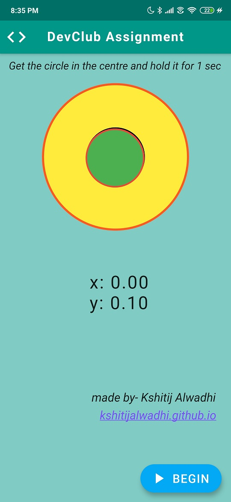

# DevClubFlutterAssignment
Game made using flutter involving the use of sensors library as a part of an assignment of Dev Club - IITD during winter break.

The app utilizes the readings of accelerometer of the device. Basically you have to orient your phone such that the movable circle aligns itself in the inner (target) circle and then hold it at that position for 1 second.

## Packages used:
 1) Material
 2) Sensors
 3) dart:async
 4) url_laumcher

 

